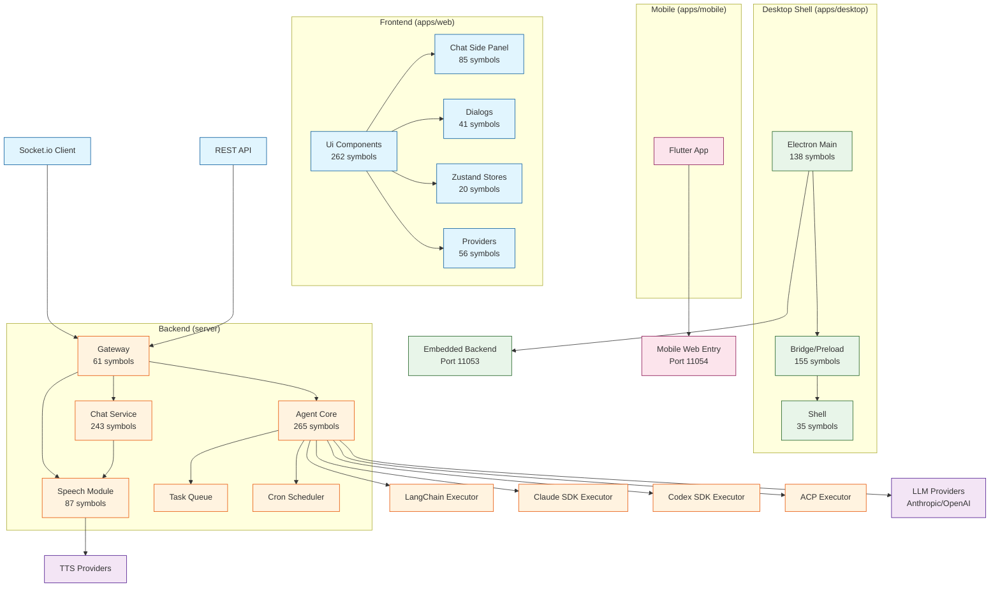
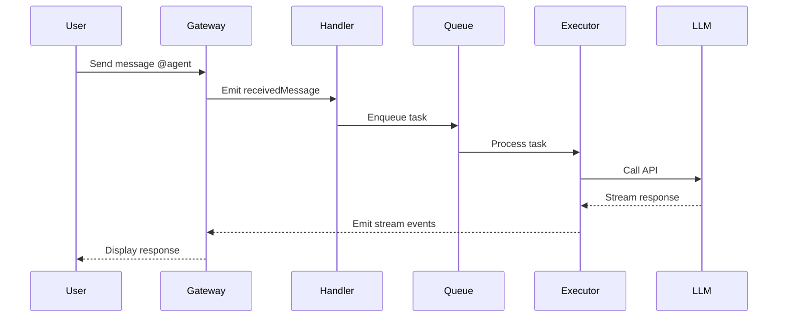

# TeamAgentX Architecture

Generated from GitNexus knowledge graph analysis.

## Overview

TeamAgentX is a multi-agent collaboration platform with a Feishu/Lark-like UI. The codebase contains:

- **630 files**
- **12,209 symbols**
- **300 execution flows**

The system is organized as a monorepo with four main applications:
- `apps/web/` - React frontend
- `apps/desktop/` - Electron desktop shell
- `apps/mobile/` - Flutter mobile app
- `server/` - Fastify backend

## Functional Areas

| Area | Symbols | Cohesion | Description |
|------|---------|----------|-------------|
| Agent | 265 | 82% | Core agent execution, LangChain/Claude SDK/Codex executors, task queue |
| Ui | 262 | 81% | Frontend components, shadcn/ui, dialogs, side panels |
| Chat | 243 | 82% | Chat messages, rooms, real-time communication, Socket.io |
| Bridge | 155 | 66% | Cross-platform IPC, Electron preload, native API bridges |
| Electron | 138 | 78% | Desktop shell, main process, utility process for embedded backend |
| Speech | 87 | 85% | Voice synthesis, speech providers, TTS configuration |
| Gateway | 61 | 71% | Fastify WebSocket/Socket.io gateways for real-time events |
| Providers | 56 | 80% | React context providers, state management hooks |
| Stores | 20 | 86% | Zustand stores for client state |

## Key Execution Flows

### 1. Agent Execution (Exec → Dispatch)

Core flow for Claude SDK agent execution:
```
exec → handleClearContext → saveSessionId → getSessionStatePath → shortHash
```
Located in: `server/src/core/agent/claude-sdk.executor.ts`

Session management for Claude conversations with state persistence.

### 2. Task Queue Recovery (RecoverPendingTasks → GetQueueLength)

Queue processing and status broadcasting:
```
recoverPendingTasks → processQueue → broadcastAgentStatus → getAgentStatuses → getQueueLength
```
Located in: `server/src/core/agent/agent-handler/`

Handles interrupted task recovery and sequential queue processing per chatroom-agent context.

### 3. Scheduled Tasks (CronTaskGateway → Stop)

Cron task lifecycle management:
```
cronTaskGateway → reloadTask → scheduleTask → unscheduleTask → clearJob → stop
```
Located in: `server/src/core/cron/cron-scheduler.service.ts`

Room-level scheduled task definitions and execution.

### 4. ChatRoom Initialization (ChatRoomGateway → CreateDefaultAgentSpeechConfig)

Room creation with speech configuration:
```
chatRoomGateway → serializeChatRoomForResponse → deserializeAgentSpeechConfig → normalizeAgentSpeechConfig
```
Located in: `server/src/gateway/chatroom.gateway.ts`

### 5. Session Cleanup (Cleanup → Dispatch)

Session reset flow:
```
cleanup → resetSession → saveSessionId → getSessionStatePath → shortHash
```
Located in: `server/src/core/agent/claude-sdk.executor.ts`

## Architecture Diagram



## Data Flow

### Message Flow

1. User sends message via Web/Desktop/Mobile UI
2. Socket.io gateway receives `message` event
3. `agent-handler` processes message and queues task
4. Executor (LangChain/Claude SDK/Codex/ACP) runs agent
5. Stream events sent back via Socket.io (`agent:stream`, `agent:typing`, `agent:tool_call`)
6. Final response stored in database and broadcast to room

### Agent Execution Pipeline



## Technology Stack

| Layer | Technology |
|-------|------------|
| Frontend UI | React 19, TypeScript, Tailwind CSS 4, shadcn/ui |
| Frontend State | Zustand, Socket.io-client |
| Desktop | Electron 41, utilityProcess for embedded backend |
| Mobile | Flutter/Dart, Provider, go_router |
| Backend | Fastify 5, TypeScript, Socket.io |
| Database | Prisma 7, SQLite/libsql |
| Agent Execution | LangChain/LangGraph, Claude SDK, Codex SDK, ACP SDKs |
| Auth | JWT |

## Key Design Patterns

1. **Factory Pattern**: `executor.factory.ts` creates appropriate executor based on agent type
2. **Event-Driven**: `EventEmitter` for message handling triggers agent execution
3. **Queue Processing**: Sequential task processing per chatroom-agent context
4. **Caching**: Executor instances cached per room-agent for session isolation
5. **Gateway Pattern**: Socket.io gateways for real-time bidirectional communication