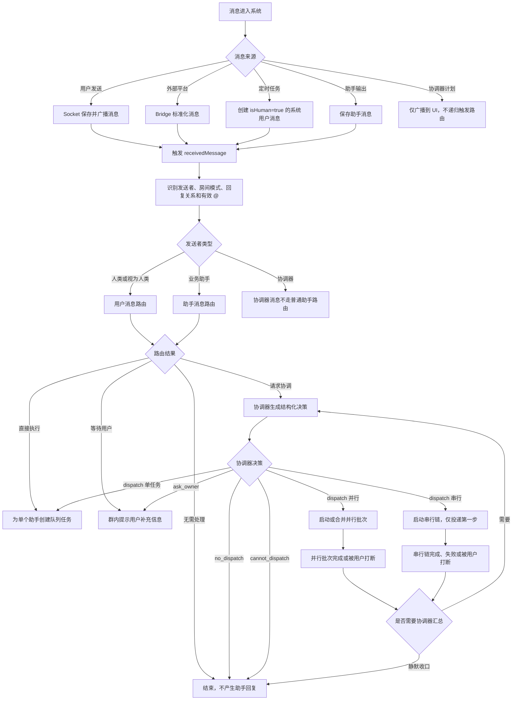
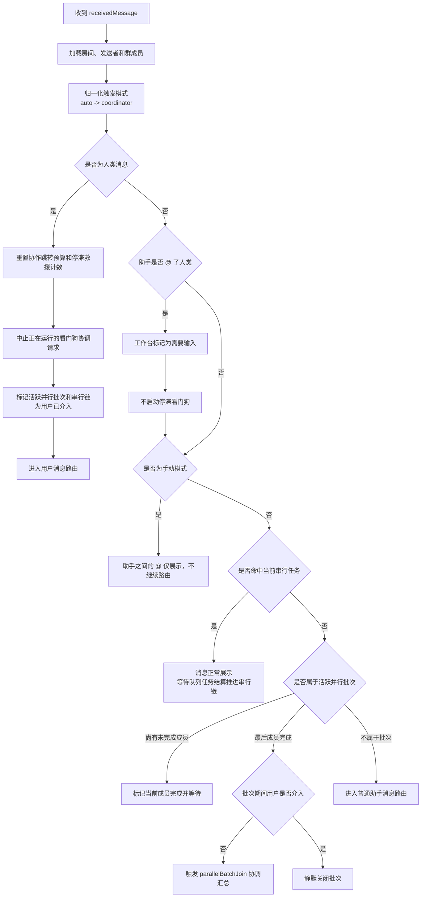
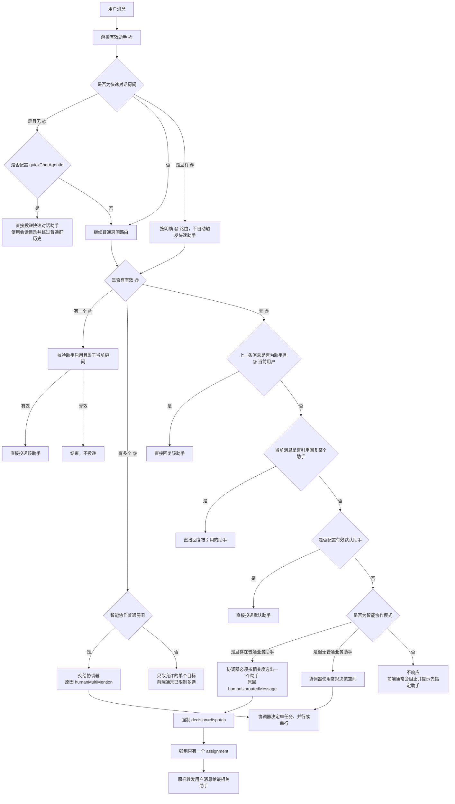
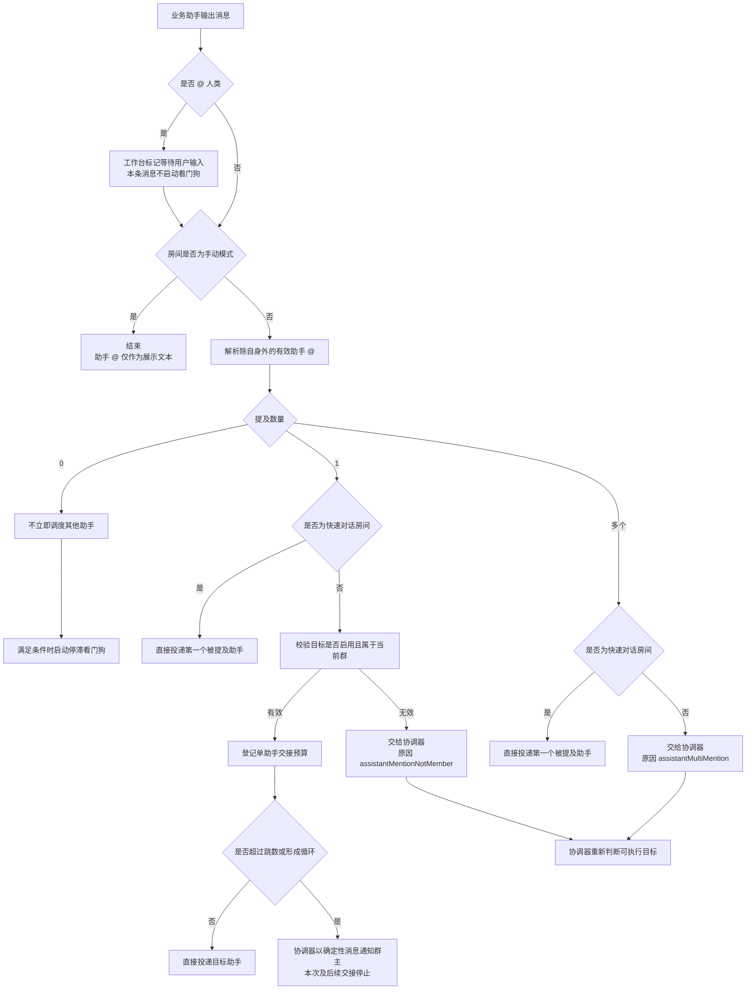
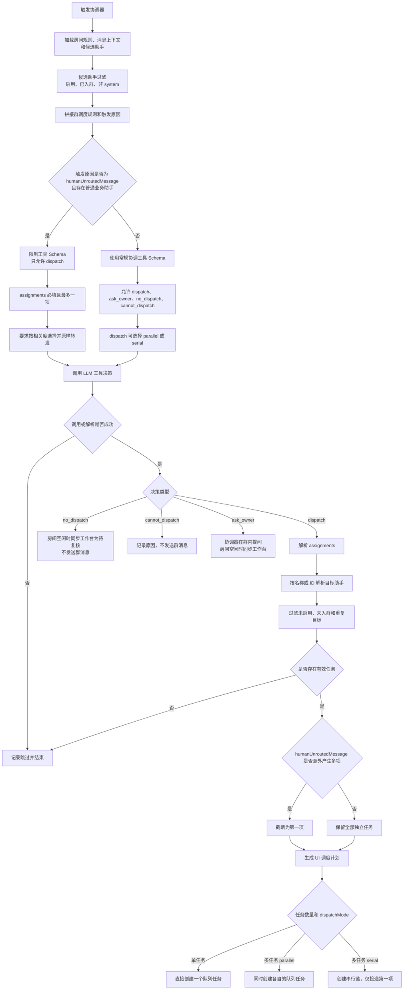
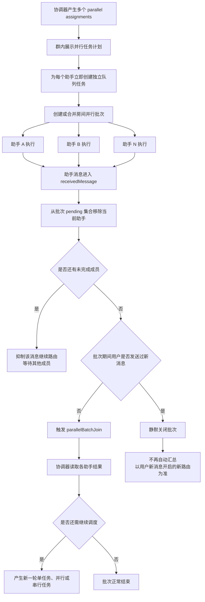
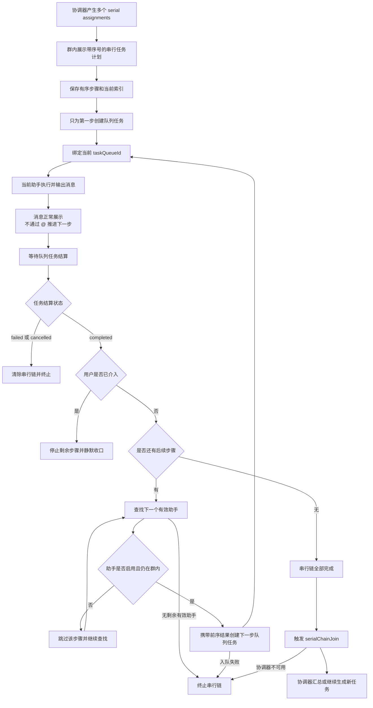
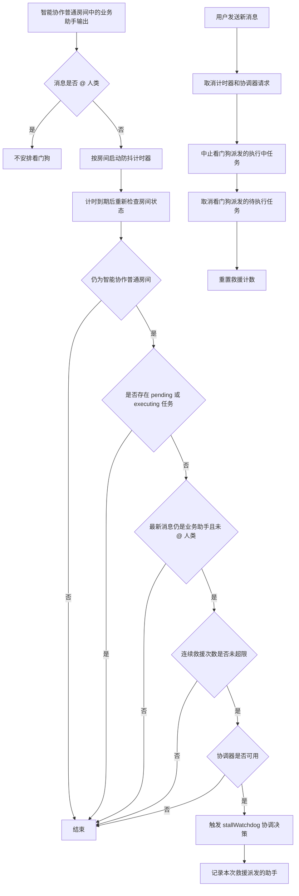
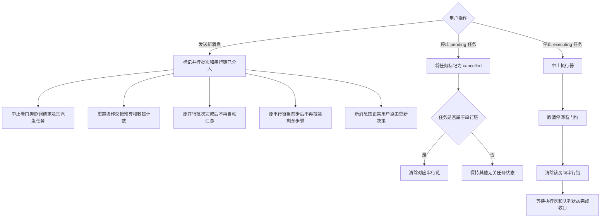
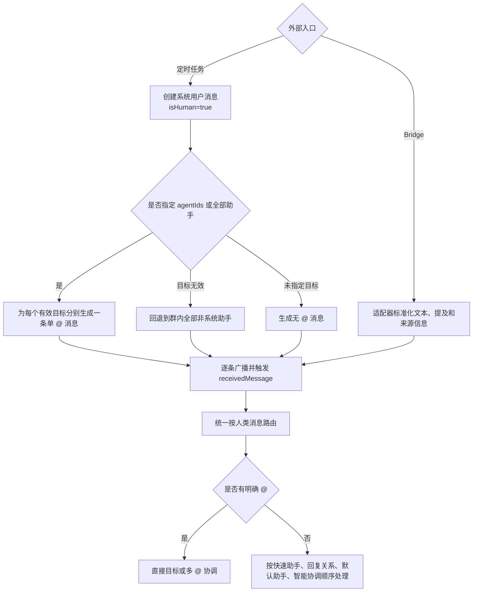

# TeamAgentX 调度系统全场景流程图

> 更新日期：2026-06-15  
> 状态：当前实现说明，以服务端源码为准  
> 范围：Web、桌面端、移动端、Bridge 和定时任务进入同一消息调度链路后的行为

## 1. 核心概念

| 概念 | 说明 |
| --- | --- |
| 智能协作模式 | 服务端值为 `coordinator`。历史值 `auto` 会被归一化为该模式 |
| 手动模式 | 服务端值为 `manual`。用户可通过明确 `@` 或有效默认助手触发；助手消息不会自动接力 |
| 快速对话 | 房间带有 `quickChatAgentId`，无 `@` 时直接交给快速对话助手 |
| 普通业务助手 | 已加入当前群、处于启用状态且 `agentLevel != system` 的助手 |
| 协调器 | 系统级助手，负责输出结构化调度决策，不作为普通业务候选 |
| 独立任务 | 协调器的每条 `assignment` 只发送给一个目标助手 |
| 并行调度 | 多个独立任务同时入队，全部完成后再由协调器汇总 |
| 串行调度 | 每次只入队一个任务，前一步完成后才投递下一步 |
| UI 调度计划 | 协调器在群里展示的整体任务计划，仅用于展示，不再次触发消息路由 |

## 2. 全局总览



## 3. 消息预处理与通用拦截



### `@` 识别规则

- 只识别当前房间内启用助手的名称。
- 代码块和行内代码中的 `@` 会被忽略。
- 中文连续文本中的 `@助手名` 可以识别。
- 类似邮箱地址的 ASCII 文本不会被误判为助手提及。
- 同一助手被重复提及时只保留一次。
- 长名称优先匹配，避免被短名称截断。

## 4. 用户消息完整路由



### 无默认助手时的智能协作规则

当用户没有 `@`、没有可用回复目标、没有默认助手，并且房间处于智能协作模式时：

1. 从当前群内所有启用的普通业务助手中选择。
2. 按助手名称、描述和调度规则与用户消息的相关度判断。
3. 必须选择一个助手执行，不允许返回 `no_dispatch`、`ask_owner` 或 `cannot_dispatch`。
4. 只生成一个独立任务。
5. 将用户原始消息完整转发给被选中的助手，避免协调器改写后丢失要求。
6. 只有群内不存在任何普通业务助手时，才回退到协调器的常规决策空间。

## 5. 助手消息完整路由



### 助手直连交接预算

- 预算只限制“单个助手明确 `@` 另一个助手”的快速交接路径。
- 每次人类发送新消息都会重置预算。
- 限制包含最大交接跳数和同一对助手持续往返形成的循环。
- 超限后不再调用大模型判断，而是由协调器发送确定性的停止提示。
- 协调器主动创建的并行或串行任务不使用该快速交接预算。

## 6. 协调器结构化决策



### 调度计划与实际任务消息

协调器会先在群内展示完整计划，例如：

```md
**并行任务**

- @前端助手：实现页面和交互
- @后端助手：实现接口和数据模型
```

但实际执行时会拆成两个彼此独立的队列任务：

```text
@前端助手 实现页面和交互
```

```text
@后端助手 实现接口和数据模型
```

这样既能让群内计划清晰可读，也能保证每个助手只接收到自己的任务。串行模式同样拆分任务，只是按顺序逐个投递。

## 7. 并行调度生命周期



### 并行批次规则

- 同一房间已有并行批次时，新并行任务会合并到当前批次，不覆盖未完成成员。
- 批次成员输出中的助手 `@` 不会立即触发新任务，必须等待批次汇合。
- 最后一个成员完成后，只有在用户没有介入时才自动请求协调器汇总。
- 用户在批次期间发新消息，会保留已产生的消息，但关闭原批次的自动汇总。

## 8. 串行调度生命周期



### 串行推进规则

- 助手消息只负责展示结果，不负责推进链路。
- 队列任务的 `completed`、`failed` 或 `cancelled` 结算事件才是唯一推进依据。
- 下一步会获得之前助手的最终输出作为历史上下文。
- 后续助手已停用或离开群时会被跳过。
- 用户插话后，当前步骤可正常结算，但剩余步骤不再自动执行。

## 9. 停滞看门狗



看门狗只处理“助手说完后房间空闲，但协作可能还没真正结束”的情况。它不会在仍有队列任务、助手正在等待用户输入或救援次数已超限时继续调度。

## 10. 用户介入与停止任务



## 11. 定时任务与 Bridge 消息



定时任务消息末尾会附带任务名称。Bridge 消息保留平台来源信息，并在创建助手队列任务时继续向下传递。

## 12. 全场景决策表

| 场景 | 调度结果 |
| --- | --- |
| 快速对话，无 `@` | 直接执行 `quickChatAgentId` |
| 快速对话，有 `@` | 执行明确提及的第一个助手 |
| 用户单 `@` 有效助手 | 直接执行该助手 |
| 用户多 `@`，智能协作普通房间 | 交给协调器拆分为单任务、并行或串行 |
| 用户无 `@`，上一条助手明确 `@` 用户 | 直接回复上一条助手 |
| 用户引用回复助手消息 | 直接回复被引用助手 |
| 用户无 `@`，有有效默认助手 | 直接执行默认助手 |
| 用户无 `@`、无默认助手、智能协作、有业务助手 | 协调器按相关度强制选择一个助手 |
| 用户无 `@`、无默认助手、智能协作、无业务助手 | 协调器使用常规决策，可能不派发或询问用户 |
| 用户无 `@`、无默认助手、手动模式 | 不执行；前端通常提前提示 |
| 助手无 `@` | 不立即转交；必要时由停滞看门狗救援 |
| 助手单 `@` 有效群成员 | 在预算允许时直接交接 |
| 助手单 `@` 无效或非群成员 | 交给协调器修正目标 |
| 助手多 `@` | 交给协调器决定并行或串行 |
| 助手只 `@` 人类 | 等待用户输入，不启动看门狗，也不产生助手交接 |
| 助手同时 `@` 人类和助手 | 标记等待用户输入，同时继续处理其中的助手交接 |
| 手动模式下助手 `@` 助手 | 仅展示，不继续执行 |
| 并行最后一个成员完成且用户未介入 | 协调器汇总 |
| 并行期间用户介入 | 批次静默关闭，不自动汇总 |
| 串行当前步骤完成且用户未介入 | 投递下一步，尾部再由协调器汇总 |
| 串行步骤失败或取消 | 终止整条串行链 |
| 串行期间用户介入 | 当前步后停止剩余步骤 |
| 协调器请求失败或结构化结果无法解析 | 记录后结束，不创建任务 |
| 协调器目标停用、离群或重复 | 过滤；无有效目标时结束 |
| 代码中的 `@助手` | 不触发 |
| 定时任务指定多个助手 | 为每个助手创建独立的单 `@` 消息 |
| Bridge 用户消息 | 与普通用户消息进入同一调度流程 |

## 13. 必须保持的调度不变量

1. 协调器的每个 `assignment` 只能描述一个助手的独立任务。
2. 并行与串行是任务之间的执行关系，不应把多个助手的要求塞进同一任务消息。
3. 群内完整调度计划只用于展示，不能再次触发 `receivedMessage`，否则会重复调度。
4. 智能协作模式下，用户无路由目标但群内有业务助手时，必须按相关度选出一个助手。
5. 并行任务必须等待全部成员汇合后再继续协调，除非用户已经介入。
6. 串行任务必须由队列结算事件推进，不能依赖助手输出文本中的 `@`。
7. 用户新消息具有中断旧协作链的优先级，旧批次和旧串行链不得覆盖用户的新意图。
8. 默认助手、快速对话助手和明确回复目标均属于确定性路由，优先于协调器推理。
9. 只有当前房间内启用的助手才能成为最终执行目标。
10. 协调器自身不得出现在普通业务助手的相关度候选列表中。

## 14. 主要源码位置

| 职责 | 文件 |
| --- | --- |
| 消息总路由 | `server/src/core/agent/agent-handler/handler.ts` |
| `@` 解析与消息工具 | `server/src/core/agent/agent-handler/message-utils.ts` |
| 协调器结构化决策 | `server/src/core/agent/coordinator-dispatch.ts` |
| 并行批次跟踪 | `server/src/core/agent/agent-handler/parallel-batch-tracker.ts` |
| 串行链跟踪 | `server/src/core/agent/agent-handler/serial-chain-tracker.ts` |
| 串行任务结算推进 | `server/src/core/agent/agent-handler/task-lifecycle.ts` |
| 停滞看门狗 | `server/src/core/agent/agent-handler/stall-watchdog.ts` |
| 助手交接预算 | `server/src/core/agent/agent-handler/collaboration-budget.ts` |
| 定时任务消息入口 | `server/src/core/cron/cron-scheduler.service.ts` |
| Bridge 消息入口 | `server/src/modules/bridge/bridge.service.ts` |
| Socket 消息入口与停止任务 | `server/src/socket/index.ts` |

## 15. 阅读顺序建议

排查某条消息为什么没有触发助手时，按以下顺序检查：

1. 消息是否真正触发了 `receivedMessage`。
2. 房间是快速对话、智能协作还是手动模式。
3. `@` 是否被识别，目标是否启用并属于当前群。
4. 是否命中快速助手、回复关系或默认助手等确定性路由。
5. 是否进入协调器，以及协调器的触发原因。
6. 协调器是否生成有效 `assignments`，目标是否在过滤后仍有效。
7. 任务属于单任务、并行批次还是串行链。
8. 用户是否在执行期间发送新消息或停止任务。
9. 是否存在交接预算、看门狗次数、任务失败或协调器不可用等终止条件。
