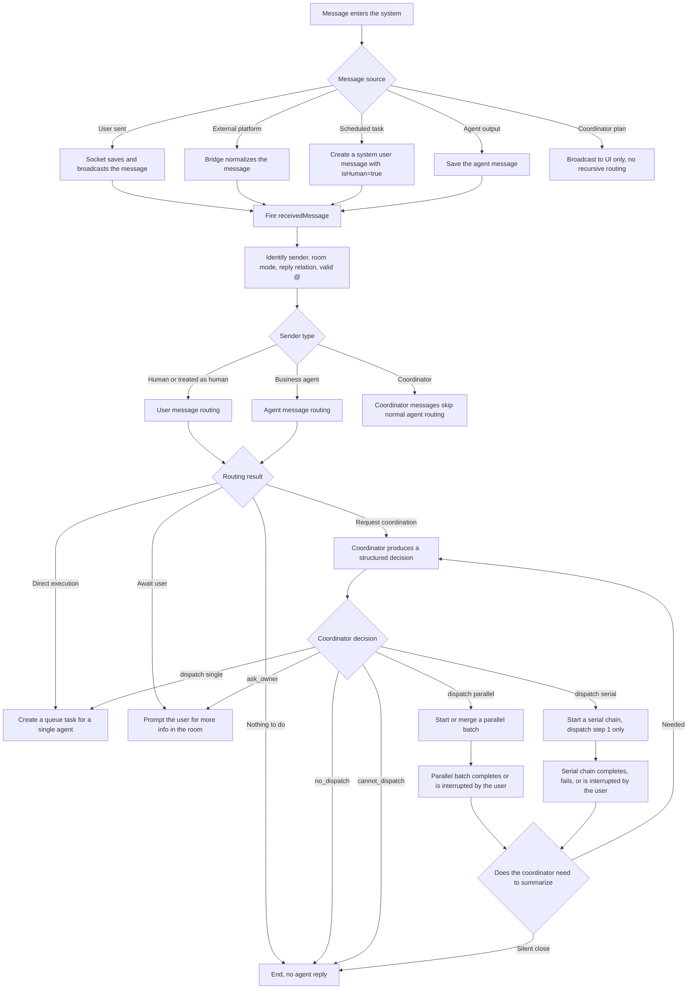
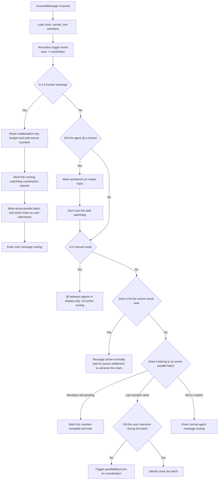
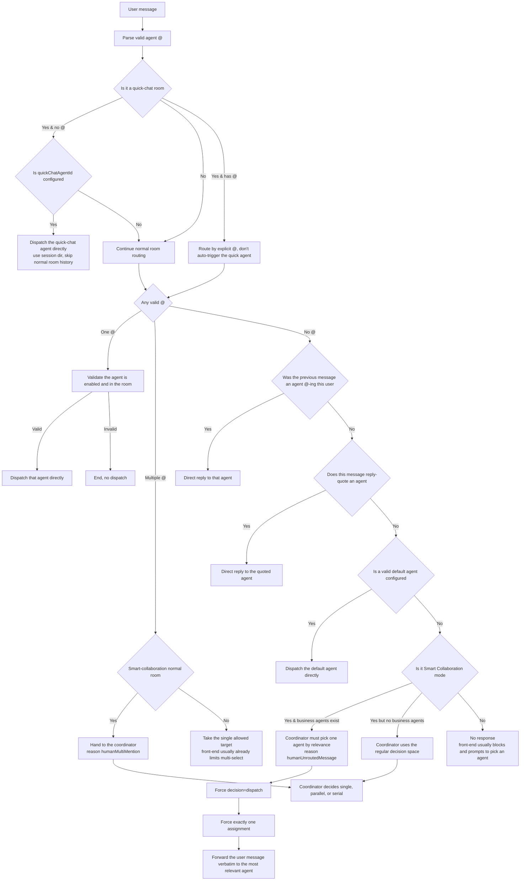
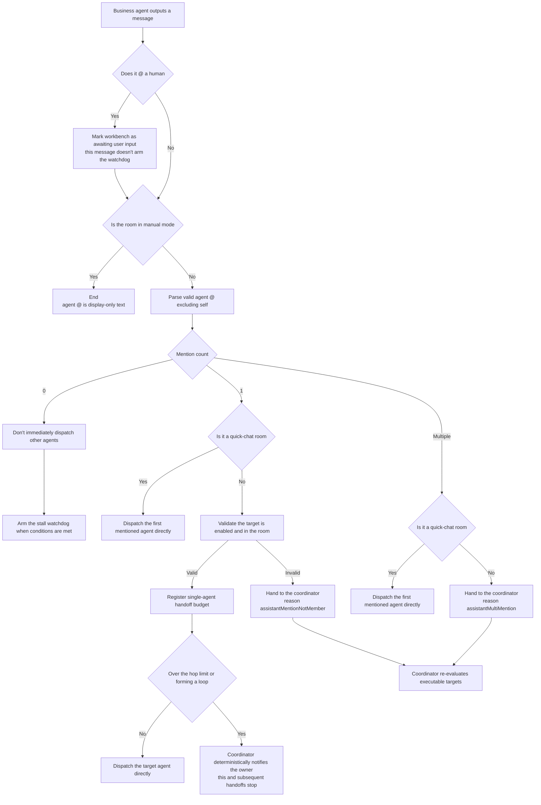
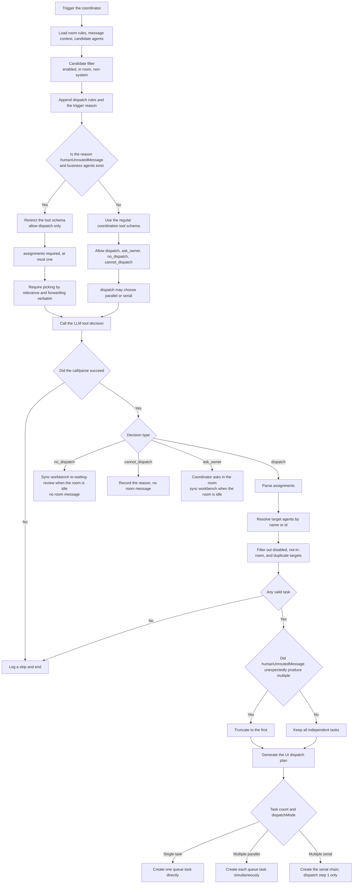
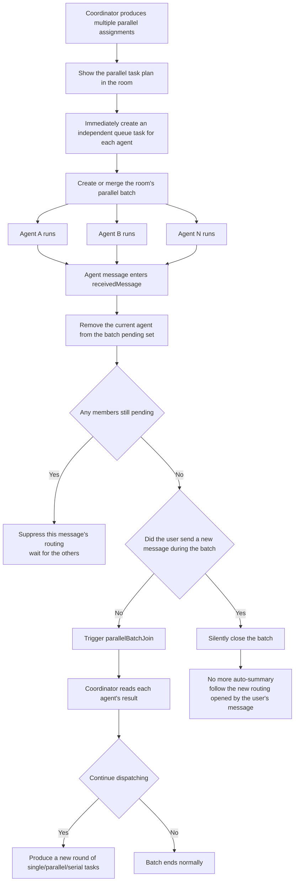
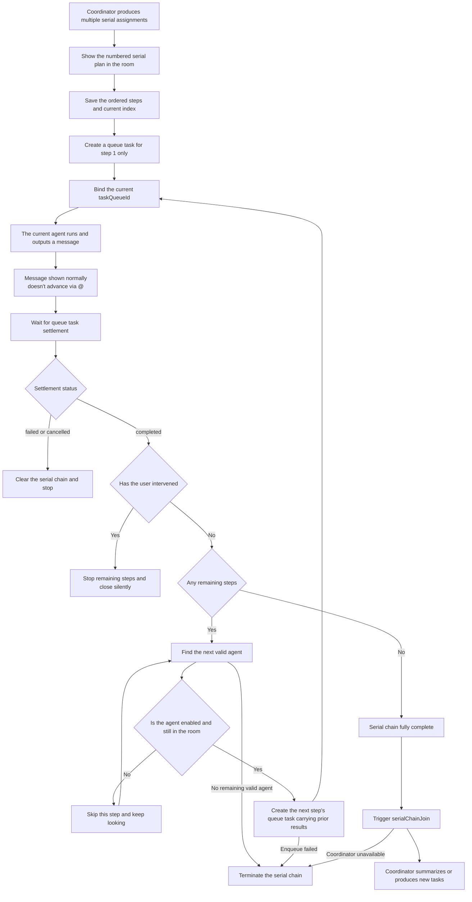
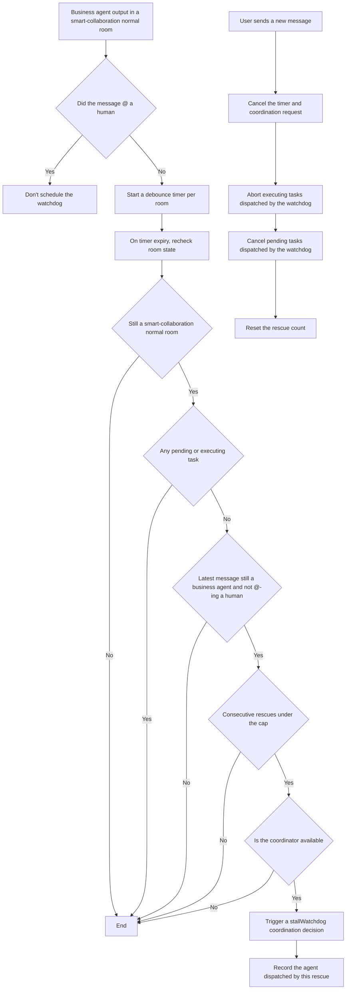
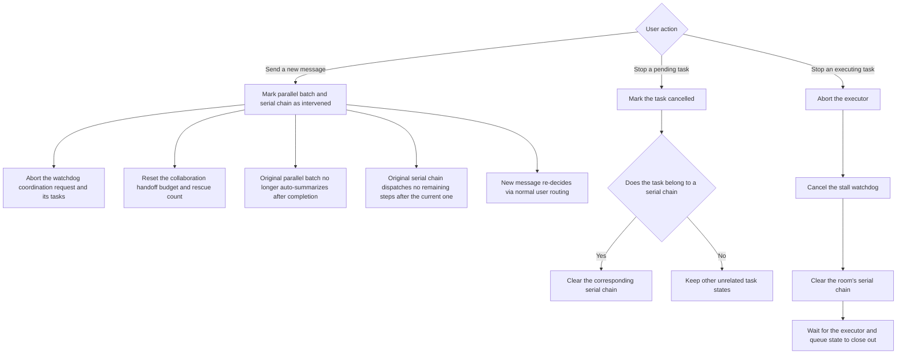
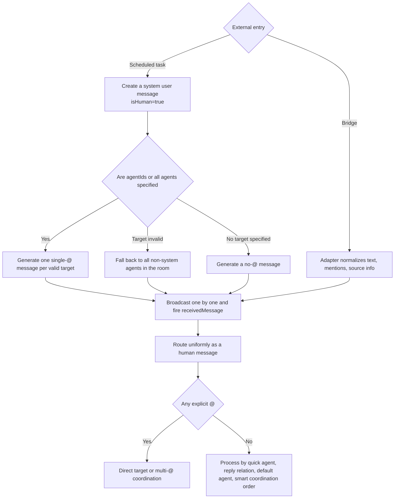

# TeamAgentX Dispatch System — Full Scenario Flowcharts

English | [中文](14-agent-dispatch-flowcharts.md)

> Updated: 2026-06-15
> Status: description of the current implementation; the server source is authoritative
> Scope: behavior after Web, desktop, mobile, Bridge, and scheduled tasks enter the same message dispatch pipeline

## 1. Core Concepts

| Concept | Meaning |
| --- | --- |
| Smart Collaboration mode | Server value `coordinator`. The legacy value `auto` is normalized to this mode |
| Manual mode | Server value `manual`. The user triggers via an explicit `@` or a valid default agent; agent messages do not auto-relay |
| Quick chat | A room with `quickChatAgentId`; with no `@`, the message goes directly to the quick-chat agent |
| Business agent | An agent that has joined the room, is enabled, and has `agentLevel != system` |
| Coordinator | A system-level agent that outputs structured dispatch decisions; not a normal business candidate |
| Independent task | Each coordinator `assignment` is sent to exactly one target agent |
| Parallel dispatch | Multiple independent tasks enqueued at once; the coordinator summarizes after all finish |
| Serial dispatch | Only one task enqueued at a time; the next step is dispatched only after the previous finishes |
| UI dispatch plan | The overall task plan the coordinator shows in the room — display only, does not re-trigger message routing |

## 2. Global Overview



## 3. Message Preprocessing & Common Interception



### `@` recognition rules

- Only names of enabled agents in the current room are recognized.
- `@` inside code blocks and inline code is ignored.
- `@agent-name` within continuous Chinese text is recognized.
- Email-like ASCII text is not mistaken for an agent mention.
- A repeated mention of the same agent is kept once.
- Longest name matches first, so a short name doesn't truncate it.

## 4. Full User Message Routing



### Smart-collaboration rule when there's no default agent

When the user has no `@`, no usable reply target, no default agent, and the room is in Smart Collaboration mode:

1. Choose from all enabled business agents in the room.
2. Judge by the relevance of agent name, description, and dispatch rules to the user message.
3. Must pick one agent to execute — `no_dispatch`, `ask_owner`, and `cannot_dispatch` are not allowed.
4. Produce exactly one independent task.
5. Forward the user's original message in full to the chosen agent, so the coordinator's rewrite doesn't drop requirements.
6. Only when no business agents exist in the room does it fall back to the coordinator's regular decision space.

## 5. Full Agent Message Routing



### Agent direct-handoff budget

- The budget only limits the fast handoff path of "one agent explicitly `@`-ing another".
- Every new human message resets the budget.
- The limits cover the max handoff hops and the loop formed by the same pair handing off back and forth.
- Once exceeded, no LLM judgment is invoked; the coordinator sends a deterministic stop notice instead.
- Parallel or serial tasks initiated by the coordinator do not use this fast-handoff budget.

## 6. Coordinator Structured Decision



### Dispatch plan vs actual task messages

The coordinator first shows the full plan in the room, e.g.:

```md
**Parallel tasks**

- @Frontend: implement the page and interactions
- @Backend: implement the API and data model
```

But execution splits it into two mutually independent queue tasks:

```text
@Frontend implement the page and interactions
```

```text
@Backend implement the API and data model
```

This keeps the in-room plan readable while ensuring each agent receives only its own task. Serial mode splits tasks the same way, just dispatched one by one in order.

## 7. Parallel Dispatch Lifecycle



### Parallel batch rules

- When the room already has a parallel batch, a new parallel task merges into the current batch without overwriting pending members.
- An agent `@` in a batch member's output does not immediately trigger a new task; it must wait for the batch to join.
- After the last member finishes, the coordinator is auto-requested to summarize only if the user has not intervened.
- A new user message during the batch keeps the produced messages but closes the original batch's auto-summary.

## 8. Serial Dispatch Lifecycle



### Serial advance rules

- Agent messages only show results; they don't advance the chain.
- A queue task's `completed`, `failed`, or `cancelled` settlement event is the only advance trigger.
- The next step gets the previous agent's final output as history context.
- A later agent that is disabled or has left the room is skipped.
- After the user interjects, the current step settles normally, but the remaining steps no longer auto-execute.

## 9. Stall Watchdog



The watchdog only handles "the agent finished, the room is idle, but the collaboration may not really be done". It won't keep dispatching while queue tasks remain, the agent is awaiting user input, or the rescue count is exceeded.

## 10. User Intervention & Stopping Tasks



## 11. Scheduled Tasks & Bridge Messages



Scheduled-task messages append the task name at the end. Bridge messages keep platform source info and pass it down when creating the agent queue task.

## 12. Full Scenario Decision Table

| Scenario | Dispatch result |
| --- | --- |
| Quick chat, no `@` | Execute `quickChatAgentId` directly |
| Quick chat, has `@` | Execute the first explicitly mentioned agent |
| User single `@` valid agent | Execute that agent directly |
| User multi-`@`, smart-collaboration normal room | Hand to the coordinator to split into single/parallel/serial |
| User no `@`, previous agent explicitly `@`-ed the user | Direct reply to the previous agent |
| User reply-quotes an agent message | Direct reply to the quoted agent |
| User no `@`, a valid default agent exists | Execute the default agent directly |
| User no `@`, no default agent, smart collaboration, business agents exist | Coordinator must pick one agent by relevance |
| User no `@`, no default agent, smart collaboration, no business agents | Coordinator uses the regular decision; may not dispatch or may ask the user |
| User no `@`, no default agent, manual mode | No execution; front-end usually prompts ahead |
| Agent no `@` | Don't hand off immediately; the stall watchdog rescues if needed |
| Agent single `@` valid room member | Hand off directly while the budget allows |
| Agent single `@` invalid or non-member | Hand to the coordinator to fix the target |
| Agent multi-`@` | Hand to the coordinator to decide parallel or serial |
| Agent `@`s only a human | Await user input; don't arm the watchdog or produce an agent handoff |
| Agent `@`s both a human and an agent | Mark awaiting user input while still processing the agent handoff |
| Manual mode, agent `@`s agent | Display only, no execution |
| Parallel last member done and no user intervention | Coordinator summarizes |
| User intervenes during a parallel batch | Batch closes silently, no auto-summary |
| Serial current step done and no user intervention | Dispatch the next step; coordinator summarizes at the tail |
| Serial step fails or is cancelled | Terminate the whole serial chain |
| User intervenes during a serial chain | Stop the remaining steps after the current one |
| Coordinator request fails or the structured result can't be parsed | Log and end, no task created |
| Coordinator target disabled, left, or duplicate | Filtered; end when no valid target remains |
| `@agent` inside code | No trigger |
| Scheduled task specifies multiple agents | Create an independent single-`@` message per agent |
| Bridge user message | Enters the same dispatch flow as a normal user message |

## 13. Dispatch Invariants That Must Hold

1. Each coordinator `assignment` describes a single agent's independent task only.
2. Parallel and serial are execution relationships between tasks; don't stuff multiple agents' requirements into one task message.
3. The full in-room dispatch plan is display only and must not re-fire `receivedMessage`, otherwise dispatch duplicates.
4. In Smart Collaboration, when the user has no routing target but business agents exist, one agent must be picked by relevance.
5. Parallel tasks must wait for all members to join before further coordination, unless the user has intervened.
6. Serial tasks must be advanced by queue settlement events, not by `@` in agent output text.
7. A new user message has priority to interrupt the old collaboration chain; old batches/serial chains must not override the user's new intent.
8. Default agent, quick-chat agent, and explicit reply targets are deterministic routing and take priority over coordinator reasoning.
9. Only enabled agents in the current room can be final execution targets.
10. The coordinator itself must not appear in the business-agent relevance candidate list.

## 14. Main Source Locations

| Responsibility | File |
| --- | --- |
| Message master routing | `server/src/core/agent/agent-handler/handler.ts` |
| `@` parsing & message utils | `server/src/core/agent/agent-handler/message-utils.ts` |
| Coordinator structured decision | `server/src/core/agent/coordinator-dispatch.ts` |
| Parallel batch tracking | `server/src/core/agent/agent-handler/parallel-batch-tracker.ts` |
| Serial chain tracking | `server/src/core/agent/agent-handler/serial-chain-tracker.ts` |
| Serial task settlement advance | `server/src/core/agent/agent-handler/task-lifecycle.ts` |
| Stall watchdog | `server/src/core/agent/agent-handler/stall-watchdog.ts` |
| Agent handoff budget | `server/src/core/agent/agent-handler/collaboration-budget.ts` |
| Scheduled task message entry | `server/src/core/cron/cron-scheduler.service.ts` |
| Bridge message entry | `server/src/modules/bridge/bridge.service.ts` |
| Socket message entry & stopping tasks | `server/src/socket/index.ts` |

## 15. Suggested Reading Order

When debugging why a message didn't trigger an agent, check in this order:

1. Whether the message actually fired `receivedMessage`.
2. Whether the room is quick-chat, smart-collaboration, or manual mode.
3. Whether the `@` was recognized and the target is enabled and in the room.
4. Whether deterministic routing (quick agent, reply relation, default agent) was hit.
5. Whether the coordinator was reached, and its trigger reason.
6. Whether the coordinator produced valid `assignments` and whether targets remain valid after filtering.
7. Whether the task is a single task, parallel batch, or serial chain.
8. Whether the user sent a new message or stopped tasks during execution.
9. Whether a termination condition exists: handoff budget, watchdog count, task failure, or coordinator unavailability.
```
