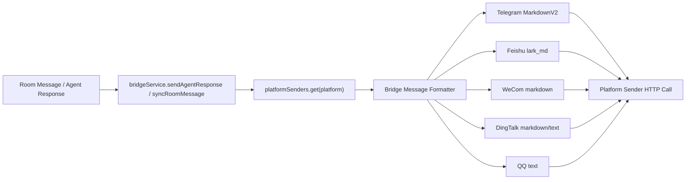

# Technical Design: channel-markdown-support

**Generated**: 2026-05-19
**Status**: Draft
**Input**: [requirements.md](/Users/liqing/qing/code/team/teamagentx/specs/channel-markdown-support/requirements.md)

---

## 1. 设计目标

本方案将 TeamAgentX 当前“平台 sender 直接处理原始文本”的模式，调整为“统一 Markdown 输入 -> 平台格式转换 -> 平台发送”的三段式链路。

目标：

- 保留 `bridgeService.sendAgentResponse` / `syncRoomMessage` 的调用方式不变
- 将平台差异尽量收敛在 `server/src/modules/bridge/` 内部
- Telegram 改为 `MarkdownV2`
- 飞书改为 `lark_md`
- 企业微信、钉钉、QQ 按各自支持格式或纯文本降级
- 为后续新增频道提供统一扩展点

非目标：

- 本期不统一富媒体消息、卡片布局、图片附件
- 本期不改消息编辑器输入格式
- 本期不追求所有平台完全一致的视觉渲染

---

## 2. 当前架构观察

现有出站链路已经具备比较合适的隔离层：

- `bridgeService.syncRoomMessage()` 与 `bridgeService.sendAgentResponse()` 负责收集目标频道并调用 sender，见 [bridge.service.ts](/Users/liqing/qing/code/team/teamagentx/server/src/modules/bridge/bridge.service.ts:472) 和 [bridge.service.ts](/Users/liqing/qing/code/team/teamagentx/server/src/modules/bridge/bridge.service.ts:516)
- sender 注册在 `registerBridgePlatformAdapters()`，见 [platform-senders.ts](/Users/liqing/qing/code/team/teamagentx/server/src/modules/bridge/platform-senders.ts:769)
- 各平台发送逻辑集中在 [platform-senders.ts](/Users/liqing/qing/code/team/teamagentx/server/src/modules/bridge/platform-senders.ts:1)

这意味着我们不需要改上游消息来源，只需要把 sender 内部逻辑从“直接发文本”升级为“先做平台格式转换，再发目标格式”。

---

## 3. 方案概览

### 核心思路

引入一个轻量的“平台消息转换层”，放在 `platform-senders.ts` 同级目录中：

1. 输入仍然是统一 Markdown 文本 `text`
2. 根据平台选择对应转换器
3. 转换器输出“平台格式描述 + 平台消息体”
4. sender 按转换结果调用平台 API

### 设计原则

- 上游只提供统一文本，不感知平台格式
- 转换器只负责“文本语义 -> 平台格式”
- sender 只负责“平台格式 -> HTTP 请求”
- 不支持的语法在转换层降级，不把异常留给平台接口

### 架构图



---

## 4. 模块设计

### 4.1 新增模块

建议新增以下文件：

- `server/src/modules/bridge/message-formatters.ts`
- `server/src/modules/bridge/message-formatters.test.ts`

如实现复杂度上升，可再拆分：

- `server/src/modules/bridge/message-formatters/telegram.ts`
- `server/src/modules/bridge/message-formatters/feishu.ts`
- `server/src/modules/bridge/message-formatters/shared.ts`

本期更推荐先从单文件起步，避免过度抽象。

### 4.2 核心接口

建议定义以下结构：

```ts
type PlatformMessageFormat =
  | 'telegram_markdown_v2'
  | 'feishu_lark_md'
  | 'wecom_markdown'
  | 'dingtalk_markdown'
  | 'plain_text';

interface FormattedBridgeMessage {
  format: PlatformMessageFormat;
  body: string;
}

interface BridgeMessageFormatter {
  platform: Platform;
  format(text: string, agentName: string, options?: { isRoomMessage?: boolean; deliveryPath?: string }): FormattedBridgeMessage;
}
```

说明：

- `format` 表示目标平台原生格式，不是输入格式
- `body` 是 sender 可直接使用的文本内容
- `deliveryPath` 用于钉钉这类“同平台不同通道能力不同”的情况

---

## 5. 平台转换策略

### 5.1 统一可移植语义

转换层只承诺以下语义尽量保真：

- 段落与换行
- 粗体
- 斜体
- 引用
- 行内代码
- 代码块
- 链接
- 无序列表

不在最小子集内的语法，统一进入降级逻辑：

- 表格 -> 多行纯文本
- 任务列表 -> 保留 `[x]` / `[ ]` 字面值
- HTML -> 去标签后保留文本
- 图片语法 -> `alt (url)`

### 5.2 Telegram

目标格式：`MarkdownV2`

策略：

- 移除当前 `markdownToTelegramHtml()` 方案
- 改为 `markdownToTelegramMarkdownV2()`
- 对 Telegram 保留字符统一转义
- 代码块、行内代码、链接、引用使用 Telegram 支持的 `MarkdownV2` 语法
- 不兼容结构先降级，再做最终转义

风险点：

- `MarkdownV2` 对保留字符要求非常严格
- 错误的转义顺序会导致整条消息被拒绝

建议：

- 先做“语义占位 -> 普通文本转义 -> 还原语义片段”的两阶段转换
- 保留失败后降级纯文本重试能力

### 5.3 飞书

目标格式：`lark_md`

策略：

- 用 `lark_md` 作为主要输出目标，而不是继续直接拼当前 card markdown
- 如果平台接口仍需 `interactive` 卡片承载，则在卡片内部承载 `lark_md` 内容 [推演]
- 对不支持的 GFM/HTML 结构提前降级

风险点：

- 当前代码使用的是 `tag: 'markdown'` 卡片元素，和严格意义上的 `lark_md` 可能不是完全相同的承载方式

建议：

- 在 formatter 层先以“飞书 Markdown 子集”统一产出
- sender 再决定是走消息体还是卡片体，避免格式规则散落在 sender 里

### 5.4 企业微信

目标格式：`markdown`

策略：

- 继续使用企业微信 markdown 类型
- 保留现有 `<font color="info">` 头部样式
- 对复杂嵌套、表格、任务列表统一降级

### 5.5 钉钉

目标格式：`markdown` 或 `plain_text`

策略：

- 默认出站群消息仍走 markdown 模板
- 若 `deliveryPath` 表示 `sessionWebhook`，则直接格式化为纯文本
- 由 formatter 明确返回 `dingtalk_markdown` 或 `plain_text`

这样 sender 不需要自己判断“用 markdown 还是 text”，只需执行 formatter 结果。

### 5.6 QQ

目标格式：`plain_text`

策略：

- QQ 本期不尝试保留 Markdown 语法
- 只保留文本、换行、链接字面值
- 所有格式语义在转换层降级

---

## 6. Sender 改造方案

### 6.1 保持 `bridgeService` 不变

`bridgeService` 仍然按现在的方式调用 sender：

- `sender(bot.id, source.replyTarget, text, senderName)`
- `sender(source.botId, source.replyTarget, content, agentName)`

不改这层可以减少影响面，并避免消息事件记录逻辑联动修改。

### 6.2 改造 `platform-senders.ts`

每个平台 sender 的新职责：

1. 调用 formatter 获取 `FormattedBridgeMessage`
2. 按 `format` 决定平台 API 的 `msg_type` / `parse_mode` / `content`
3. 发送失败时记录平台错误
4. 若配置允许，对可恢复格式错误执行一次纯文本回退

示例方向：

- Telegram sender:
  - `parse_mode: 'MarkdownV2'`
  - 失败时可退为纯文本
- Feishu sender:
  - 读取 `format: 'feishu_lark_md'`
  - 将其嵌入飞书消息结构
- DingTalk sender:
  - 根据 `format` 发送 markdown 或 text

---

## 7. 数据与接口影响

本方案不要求 Prisma schema 变更。

可选增强：

- 若后续需要可观测性，可在 `bridgeEvent.contentPreview` 之外增加 `format` 字段 [推演]
- 本期不建议引入数据库变更，避免扩大范围

API 层影响：

- 外部 HTTP 路由不变
- Web 端配置接口不必立即改动
- 若后续要展示“平台支持矩阵”，可追加只读说明字段，但不属于本期必须项

---

## 8. 错误处理与降级

### 8.1 错误分类

- 转换错误：formatter 逻辑异常
- 平台格式校验错误：如 Telegram `MarkdownV2` 语法不合法
- 发送错误：鉴权失败、网络错误、平台限流

### 8.2 处理规则

- 转换错误：记录错误并退回纯文本发送
- 平台格式校验错误：只在确定是格式问题时降级为纯文本重试一次
- 鉴权/网络错误：不做格式降级重试，直接失败

### 8.3 可观测性

建议日志中增加：

- platform
- selected format
- fallback used
- original text length

这样后续能快速定位是“平台不支持”还是“转换器 bug”。

---

## 9. 测试策略

### 9.1 单元测试

在 `message-formatters.test.ts` 中覆盖：

- Telegram `MarkdownV2` 保留字符转义
- 飞书 `lark_md` 语法降级
- 企业微信/钉钉/QQ 的最小子集映射
- 表格、HTML、任务列表等不兼容语法降级

### 9.2 现有 sender 测试扩展

扩展 [platform-senders.test.ts](/Users/liqing/qing/code/team/teamagentx/server/src/modules/bridge/platform-senders.test.ts:1)：

- Telegram sender 使用 `MarkdownV2`
- 飞书 sender 使用 `lark_md`
- 钉钉不同通道输出不同格式
- QQ sender 输出纯文本

### 9.3 集成测试

复用 bridge service 测试，验证：

- 同一消息发往多个平台时不会互相污染格式
- sender 失败不会影响 `bridgeEvent` 失败记录

---

## 10. 安全与兼容性

安全要求：

- 不允许把未清洗的 Markdown/HTML 原样嵌入平台特定格式
- 所有平台格式化前都必须做目标平台级别的转义
- 保持现有 webhook/credential 校验逻辑不变

兼容性要求：

- 保持 `Platform` 枚举不变
- 保持 `bridgeService.registerSender()` 契约不变
- 允许旧消息继续以原始文本内容存储，不要求迁移历史数据

---

## 11. 实施顺序建议

1. 提取统一 formatter 层与格式枚举
2. 先迁移 Telegram 到 `MarkdownV2`
3. 再迁移飞书到 `lark_md`
4. 收敛企业微信/钉钉/QQ 的降级规则
5. 补齐测试

这样可以先解决最容易出错、也最明确指定的平台，再逐步统一其他 sender。

---

## 12. 风险与取舍

### 主要风险

- Telegram `MarkdownV2` 转义实现错误，导致发送失败
- 飞书 `lark_md` 与当前卡片承载结构存在接口细节差异
- 钉钉不同通道的能力边界若判断不准，可能出现错误格式

### 取舍

- 选择“最小可移植子集”而不是完整 Markdown，可明显降低实现和维护成本
- 不改 `bridgeService` 上游接口，可降低 blast radius
- 允许平台视觉不完全一致，以换取送达稳定性

---

## 13. Phase 2 结论

推荐方案是：

- 保持 `bridgeService` 不动
- 在 `server/src/modules/bridge/` 内新增统一 formatter 层
- sender 改为消费 formatter 结果
- Telegram 使用 `MarkdownV2`
- 飞书使用 `lark_md`
- 其他平台输出各自原生格式或纯文本降级

这条路径改动集中、可测试性好，也最符合你们当前 bridge 模块的组织方式。
