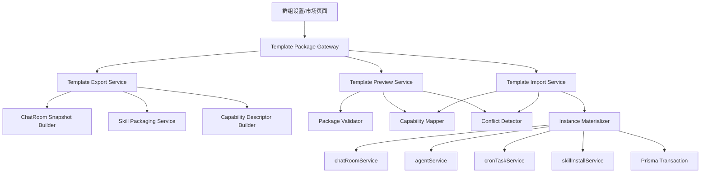

# Technical Design: 群组模板包

**Generated**: 2026-05-21
**Based on**: [requirements.md](/Users/liqing/qing/code/team/teamagentx/specs/group-template-package/requirements.md:1)
**Status**: Draft

---

## 1. 设计目标

本方案要解决的不是单纯“导出文件”，而是把现有群组沉淀为一个可迁移、可复用、可分发的工作流资产包，并且兼容以下约束：

- 不同用户本地模型供应商不同
- 技能既可能来自共享目录，也可能来自外部导入或 symlink
- 未来要复用同一套包格式承接模板市场
- 重复导入必须可预测、可回滚、不可静默覆盖

因此方案采用：

- **统一模板包格式**
- **导出/预检/导入三段式流程**
- **能力映射优先，环境绑定降级**
- **副本化导入，不做覆盖式导入**

---

## 2. 设计原则

1. **模板是资产副本，不是运行时快照**
   不迁移消息历史、执行记录、长期记忆、密钥、绝对路径等强环境数据。

2. **兼容性优先于“全量原样复制”**
   对文本、语音、图片能力保留语义化声明，再映射到导入方本地环境。

3. **模板身份与实例身份分离**
   模板有稳定 `templateId`；每次导入生成新的群组实例 ID。

4. **导入前预检，导入时事务化**
   所有兼容性、重复导入、技能降级、命名冲突都在正式落库前可见。

5. **市场兼容只预留，不超前实现**
   本期仅统一本地包格式与元数据，不做完整发布/审核/评分链路。

---

## 3. 现有系统落点

### 3.1 现有可复用能力

- 群组复制基础能力：`server/src/modules/chatroom/chatroom.service.ts` 中已有 `duplicate`
- 群组接口基础入口：`server/src/gateway/chatroom.gateway.ts`
- 助手 CRUD 与能力配置：`server/src/core/agent/agent.service.ts`
- 图片能力模型绑定：`AgentCapability`
- 语音配置：`speechConfig`
- 定时任务管理：`server/src/modules/cron-task/cron-task.service.ts`
- 技能导入与共享目录逻辑：`server/src/modules/skill/skill-install.service.ts`
- 外部技能导入网关：`server/src/gateway/skill.gateway.ts`

### 3.2 现有不足

- `duplicate` 只复制 `ChatRoom` 和 `ChatRoomAgent`，不覆盖模板级资产边界
- 没有模板身份、版本、导入记录
- 没有“能力声明 -> 本地 provider 映射”中间层
- 技能层面没有“打包成模板载荷”的统一表示

结论：不建议在 `duplicate` 上继续堆逻辑，而应新增一个 **Template Package Orchestrator** 作为上层协调层，底层复用现有 service。

---

## 4. 总体架构



---

## 4.1 当前前端入口约定

- `导入模板包`：挂在左侧群聊列表头部，属于“创建/接入一个新群组”的入口
- `导出模板包`：挂在群聊项右键菜单，属于“对某个现有群组做资产化导出”的入口

这样区分后，用户能明确感知：

- 导入是面向群聊空间的新增操作
- 导出是面向某一个具体群组的上下文操作

移动端本期不单独开放模板包入口，后续可在群聊列表更多菜单中复用同一交互语义。

---

## 5. 模块设计

## 5.1 Gateway 层

新增一个独立网关，例如：

- `server/src/gateway/template-package.gateway.ts`

建议接口：

- `POST /template-packages/export`
- `POST /template-packages/preview`
- `POST /template-packages/import`
- `GET /template-packages/import-records/:templateId` [可选，本期可后置]

原因：

- 不污染现有 `chatroom.gateway.ts` 的基础 CRUD 语义
- 更容易在未来直接挂市场下载导入流
- 预检和导入本身是模板域操作，不是群组域操作

---

## 5.2 导出服务

建议新增：

- `server/src/modules/template-package/template-export.service.ts`

职责：

- 从现有群组聚合模板快照
- 过滤敏感字段
- 调用技能打包器
- 生成模板元数据
- 写出模板包文件

导出读取范围：

- `ChatRoom`
- `ChatRoomAgent`
- `Agent`
- `AgentCategory`
- `AgentCapability`
- `CronTask`
- 技能目录内容与技能来源信息

明确排除：

- `Message`
- `ExecutionRecord`
- `AgentRoomMemory`
- 本地 `apiKey`
- provider 实例私有标识
- 绝对 `workDir`
- 外部平台密钥和 webhook

---

## 5.3 预检服务

建议新增：

- `server/src/modules/template-package/template-preview.service.ts`

职责：

- 校验模板包结构与版本
- 抽取模板摘要
- 检查模板级重复导入
- 检查资产命名冲突
- 计算能力映射结果
- 生成用户可见的预检报告

预检结果建议结构：

```ts
type TemplatePreviewResult = {
  templateMeta: TemplateMeta;
  summary: {
    agents: number;
    categories: number;
    skills: number;
    cronTasks: number;
  };
  compatibility: {
    resolved: CapabilityResolution[];
    unresolved: CapabilityResolution[];
    degraded: DegradedItem[];
  };
  conflicts: {
    duplicateTemplate: boolean;
    nameConflicts: ConflictItem[];
  };
  actions: Array<'cancel' | 'create_copy' | 'rename_copy'>;
};
```

---

## 5.4 导入服务

建议新增：

- `server/src/modules/template-package/template-import.service.ts`

职责：

- 消费预检结果
- 根据冲突策略生成导入计划
- 在事务内创建群组副本
- 创建助手、能力配置、定时任务、技能副本
- 写入导入来源记录

关键点：

- **导入不是 restore**，而是 **materialize a new instance**
- 所有落库操作应在 Prisma 事务里完成
- 文件系统写入和数据库事务要有补偿机制

建议流程：

1. 解析模板包
2. 重新运行轻量校验，确保预检结果未过期
3. 根据 `duplicateAction` 计算新名称
4. 创建群组
5. 创建分类映射
6. 创建助手及能力占位
7. 安装/复制技能
8. 创建定时任务
9. 写入 `TemplateImportRecord`
10. 返回导入结果

---

## 5.5 技能打包服务

建议新增：

- `server/src/modules/template-package/template-skill-packager.ts`

职责：

- 将群组内实际使用的技能整理为模板载荷
- 统一处理共享技能、copy 技能、symlink 技能、外部导入技能
- 对无法安全打包的技能输出降级声明

技能导出策略：

- 若技能目录为普通目录：直接复制内容到模板包
- 若技能目录为 symlink：
  - 优先解析真实目录并复制内容
  - 无法解析时写入 `missingDependency`
- 若技能存在 `.skills/origin.json`：
  - 保留来源信息
  - 不依赖导入方必须能联网重新安装

模板内建议结构：

```text
template-package/
  manifest.json
  group.json
  agents/
  categories/
  cron-tasks/
  skills/
    <skill-slug>/
      SKILL.md
      ...
  compatibility.json
```

---

## 8. 市场兼容与审计

### 8.1 市场兼容字段

模板包清单中的 `source` 统一保留以下字段：

- `type`: `local | market`
- `author`: 模板作者或来源标识
- `channel`: 未来市场渠道标识，当前本地导出默认为 `null`

数据库侧继续复用：

- `TemplatePackage.sourceType`
- `TemplatePackage.sourceLabel`
- `TemplateImportRecord.sourceLabel`

这样可以保证：

- 本地导出包和未来市场下载包走同一套 `export / preview / import` 协议
- 本期不需要实现市场运营能力，也不会阻塞后续市场接入

### 8.2 审计落点

本期模板包审计采用轻量持久化，不新增独立审计表：

- `TemplatePackage`
  - 记录导出的模板身份、版本、标题、来源类型、manifest 快照、兼容性描述
- `TemplateImportRecord`
  - 记录导入的模板身份、导入动作、目标群组、未解析能力数量、最终群组名等元数据

这套记录足以支撑：

- 判断某模板版本是否已被导入
- 回看某次导入最终创建了哪个群组副本
- 后续模板市场按模板身份和来源渠道做统计或筛选

---

## 5.6 能力映射服务

建议新增：

- `server/src/modules/template-package/capability-mapper.ts`

职责：

- 将模板中的能力声明映射到导入方本地 provider / model 配置

映射对象：

- 文本能力
- 图片能力
- 语音能力

不直接复制的字段：

- `llmProviderId`
- 本地 provider 主键
- 本地私有 API 地址

改为导出语义声明：

```ts
type CapabilityDescriptor = {
  type: 'text' | 'image' | 'audio';
  providerProtocol?: 'openai' | 'anthropic' | 'custom' | null;
  modelType: 'text' | 'image' | 'audio';
  tool?: 'claude' | 'codex' | null;
  vendorHints?: Record<string, unknown>;
  required: boolean;
};
```

映射规则建议：

- 文本助手：
  - 若 `acpTool=claude`，优先匹配 `anthropic + text`
  - 若 `acpTool=codex`，优先匹配 `openai + text`
- 图片能力：
  - 匹配 `modelType=image`
- 语音能力：
  - 根据 `speechConfig.profile` 与本地音频 provider 目录匹配

映射结果：

- `resolved`
- `requires_user_selection`
- `unsupported_but_importable`

其中 `unsupported_but_importable` 表示助手可导入，但标记为待配置，不阻塞群组创建。

---

## 5.7 冲突检测服务

建议新增：

- `server/src/modules/template-package/conflict-detector.ts`

分两层：

### 模板级冲突

通过：

- `templateId`
- `version`

识别是否曾导入过同一模板版本。

### 资产级冲突

通过：

- 原始模板资产 ID
- 内容 fingerprint
- 本地名称

识别：

- 同名群组
- 同名助手
- 同 slug 技能
- 同名分类

冲突策略：

- `cancel`
- `create_copy`
- `rename_copy`

本期不支持：

- `merge_into_existing`
- `upgrade_in_place`

确定性重命名规则建议：

- 群组：`<原名>（导入副本 N）`
- 助手：`<原名>（模板副本 N）`
- 技能：slug 保持稳定，目录名追加来源 hash

---

## 6. 数据模型设计

建议新增两个核心模型。

## 6.1 TemplatePackage

记录模板身份和元数据，用于本地与未来市场统一格式。

```prisma
model TemplatePackage {
  id               String   @id @default(uuid())
  templateId       String
  version          String
  title            String
  summary          String?
  sourceType       String   // local | market
  sourceLabel      String?
  manifestJson     String
  compatibilityJson String?
  createdBy        String?
  createdAt        DateTime @default(now())
  updatedAt        DateTime @updatedAt

  @@index([templateId, version])
}
```

## 6.2 TemplateImportRecord

记录模板导入历史，用于重复导入识别和后续追踪。

```prisma
model TemplateImportRecord {
  id               String   @id @default(uuid())
  templateId       String
  version          String
  chatRoomId       String
  importedBy       String?
  importAction     String   // create_copy | rename_copy
  sourceLabel      String?
  unresolvedCount  Int      @default(0)
  importedAt       DateTime @default(now())
  metadataJson     String?

  @@index([templateId, version])
  @@index([chatRoomId])
}
```

说明：

- 不强制把模板包文件本体持久化进数据库
- 文件仍可走本地磁盘或上传目录
- DB 只负责模板 identity 和导入追踪

---

## 7. 包格式设计

建议使用单一压缩包，内部主文件为 `manifest.json`。

`manifest.json` 示例：

```json
{
  "schemaVersion": "1.0",
  "templateId": "group-template-8f9b...",
  "version": "1.0.0",
  "title": "客服分诊群组模板",
  "summary": "包含分诊助手、总结助手、日报任务",
  "source": {
    "type": "local",
    "author": "user-123"
  },
  "contents": {
    "group": true,
    "agents": 3,
    "categories": 2,
    "skills": 4,
    "cronTasks": 1
  }
}
```

配套文件：

- `group.json`
- `categories.json`
- `agents.json`
- `cron-tasks.json`
- `compatibility.json`
- `skills/<slug>/...`

---

## 8. API 设计

## 8.1 导出

`POST /template-packages/export`

请求：

```json
{
  "chatRoomId": "room-id",
  "packageTitle": "群组模板标题",
  "packageSummary": "简介",
  "includeSkills": true,
  "includeCronTasks": true
}
```

响应：

```json
{
  "success": true,
  "data": {
    "downloadUrl": "/uploads/templates/xxx.tgz",
    "templateId": "tpl-001",
    "version": "1.0.0",
    "summary": {
      "agents": 3,
      "skills": 4
    }
  }
}
```

## 8.2 预检

`POST /template-packages/preview`

响应包含：

- 模板摘要
- unresolved capabilities
- degraded skills
- duplicate status
- allowed actions

## 8.3 导入

`POST /template-packages/import`

请求：

```json
{
  "packageToken": "preview-session-token",
  "groupName": "导入后的群组名",
  "duplicateAction": "create_copy",
  "capabilityMappings": [
    {
      "agentRef": "agent-1",
      "capabilityType": "image",
      "llmProviderId": "provider-123"
    }
  ]
}
```

---

## 9. 前端设计

本期不新增复杂视觉系统，复用现有群组与助手管理风格。

建议页面入口：

- 群组详情页/设置页：
  - `导出模板包`
- 群组列表页或创建群组弹窗：
  - `从模板包导入`
- 未来市场页：
  - `下载并导入`

导入向导建议 3 步：

1. 选择模板包
2. 预览与处理冲突/兼容性
3. 确认导入

前端需要新增的核心状态：

- `previewSession`
- `compatibilityResolutions`
- `conflictActions`
- `importResult`

---

## 10. 测试策略

### 单元测试

- manifest 解析与版本校验
- capability mapper
- conflict detector
- deterministic renaming
- skill packaging fallback

### 集成测试

- 从真实群组导出模板包
- 预检同包重复导入
- 导入含图片能力助手
- 导入含语音配置助手
- 导入技能缺失场景
- 导入事务失败回滚

### 回归测试

- 现有 `chatrooms/:id/duplicate` 不受影响
- 现有技能外部导入不受影响
- 现有助手创建与编辑不受影响

---

## 11. 安全设计

- 模板包解压必须限制目录穿越
- 技能文件复制必须限制可执行文件与异常大文件 [推演]
- 导出时过滤敏感配置
- 导入前再次服务端校验，不信任前端预检结果
- 导入审计日志必须保留

---

## 12. 风险与缓解

| 风险 | 影响 | 缓解方案 |
|---|---|---|
| 技能来源复杂，无法百分百完整打包 | 导入后部分能力缺失 | 明确降级记录，允许部分导入 |
| 本地 provider 差异大 | 助手导入后不可直接运行 | 引入 capability mapper 和待配置状态 |
| 重复导入规则不清晰 | 用户误以为被覆盖 | 固定为 copy / rename / cancel 三选一 |
| 文件系统与 DB 事务不一致 | 半成品导入残留 | 先写临时目录，成功后提交并清理 |

---

## 13. 实施建议

推荐按以下顺序实施：

1. 定义模板包格式与 Prisma 模型
2. 实现导出服务
3. 实现预检服务
4. 实现导入服务
5. 接前端导入向导
6. 补充测试与审计

---

## 14. 方案结论

这套方案的核心不是“再加一个导入导出按钮”，而是在现有群组、助手、技能体系之上增加一个新的模板资产层。它最关键的收益是：

- 先固定未来市场也能复用的包格式
- 不把本地模型差异变成导入失败
- 不把重复导入变成覆盖风险
- 最大限度复用现有 `chatRoom` / `agent` / `skill` / `cron` 体系

如果这个方向确认，我们下一步就可以继续拆 `tasks.md`，把数据库、后端、前端、测试分成可执行任务。
